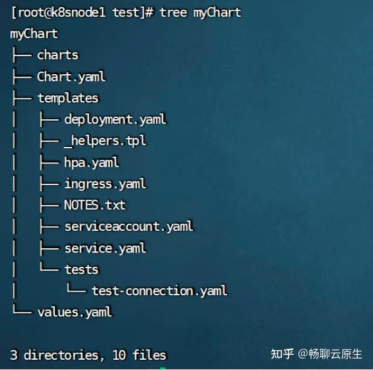
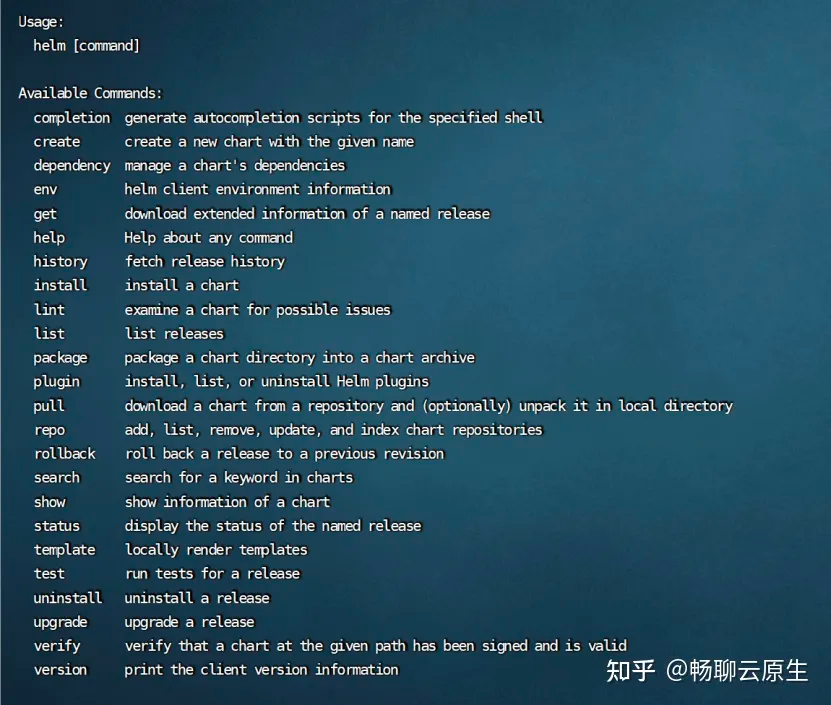
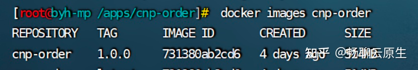
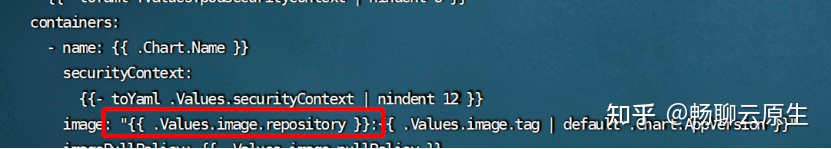
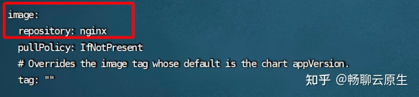
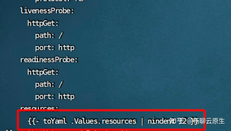
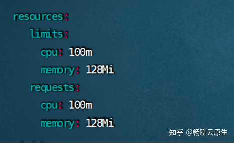
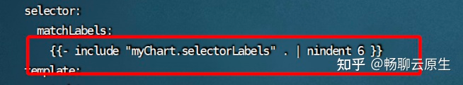
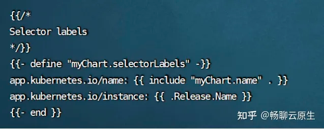
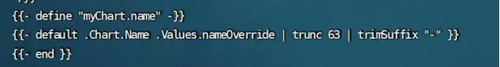

Helm的目录结构 假设我们的Chart名称叫做myChart，我们可以使用命令：

$ Helm create myChart 创建一个初始模板工程，那么在名为myChart的目录下包含了以下目录和文件：



````
其中关键的目录和文件作用如下：

★ templates/ 目录包含了模板文件。Helm会通过模板渲染引擎渲染所有该目录下的文件来生成Chart，之后将收集到的模板渲染结果发送给K8s。

★ values.yaml 文件对于模板也非常重要。这个文件包含了对于一个Chart的默认值 。这些值可以在用户执行Helm install 或 Helm upgrade时指定新的值来进行覆盖。

★ Chart.yaml 文件包含对于该Chart元数据描述。这些描述信息可以在模板中被引用。

★ _helper.tpl 包含了一些可以在Chart中进行复用的模板定义。

★ 其他诸如deployment.yaml、service.yaml、ingress.yaml文件，就是我们用于生成K8s配置文件的模板，Helm默认会按照如下的顺序将生成资源配置发送给K8s:

Namespace -> NetworkPolicy -> ResourceQuota -> LimitRange -> PodSecurityPolicy --> PodDisruptionBudget -> ServiceAccount -> Secret -> SecretList -> ConfigMap -> StorageClass -> PersistentVolume -> PersistentVolumeClaim -> CustomResourceDefinition -> ClusterRole -> ClusterRoleList -> ClusterRoleBinding -> ClusterRoleBindingList -> Role -> RoleList -> RoleBinding -> RoleBindingList -> Service -> DaemonSet -> Pod -> ReplicationController -> ReplicaSet -> Deployment -> HorizontalPodAutoscaler -> StatefulSet -> Job -> CronJob -> Ingress -> APIService
````

Helm的命令 通过在Helm的客户端中键入helm --help，我们可以看到如下截图：



其中比较常用的命令如下：

````
★helm create 创建一个Helm Chart初始安装包工程

★helm search 在Helm仓库中查找应用

★helm install 安装Helm

★helm list 罗列K8s集群中的部署的Release列表

★helm lint 对一个Helm Chart进行语法检查和校验
````

五、Helm Chart实战 准备工作和目标
首先我们准备一个基于spring-boot工程的镜像，我们无需关注工程本身的业务功能，重点介绍下这个镜像在K8s集群下资源配置。假设这个镜像已经存在于K8s的镜像仓库中，镜像名称为cnp-order，标签为1.0.0，如下图所示



镜像在K8s下的deployment.yaml配置文件内容如下：

````
apiVersion: apps/v1
kind: Deployment
metadata:
  name: cnp-order
  namespace: paas-cnp
spec:
  # 此处为程序将要启动的 pod 副本数量
  # 当副本为 1 时，pod 启动在 K8S 的 master 节点上
  replicas: 1
  selector:
    # 此处为 K8S 的 selector label
    matchLabels:
      app: cnp-order
  template:
    metadata:
      labels:
        app: cnp-order
    spec:
      volumes:
        - name: order-application
          configMap:
            # 指定该 volume 对应到 K8S 集群中相应的configMap name
            name: order-application
      containers:
        - name: cnp-order
          image: cnp-order:1.0.0
          imagePullPolicy: IfNotPresent
          # 声明 volume 到 container 的卷加载信息
          volumeMounts:
             # 此处对应 volume name 为 order-application 的卷加载信息
            - mountPath: /apps/conf/cnp-order/application.yml
              name: order-application
              subPath: application.yml
````

从上面的配置中，我们可以看到这个deployment存在于名为paas-cnp的namespace下，并且spring-boot依赖的配置文件application.yml被设置成了一个名为order-application的configmap，deployment挂载了这个configmap。同时，我们发现配置中一些配置值存在着对应关系（如volumes第一个的name和volumeMounts第一个的name）,
replicaCount被固定设置成了1（但它应该根据不同的环境在安装时被修改）。

我们在K8s中部署安装该应用过程是：首先创建namespace，再创建application.yaml文件并修改其内容，生成创建configmap，最后再创建deployment。

我们的目标是通过Helm，把上述安装过程简化，同时更好的管理配置中存在关联关系的配置值。最后，deployment的后期维护和升级也能通过Helm命令进行。

附上应用的application.yaml内容:

````
server:
    port: 9094
    servlet:
    context-path: /api/order/v1
spring:
    application:
        # 服务的实例名, 服务间的调用通过此名字调用
        name: cnp-order
    datasource:
        url: jdbc:mysql:// {ip}/cnp-order?characterEncoding=utf8&zeroDateTimeBehavior=convertToNull&useSSL=false&useJDBCCompliantTimezoneShift=true&useLegacyDatetimeCode=false&serverTimezone=GMT%2B8&nullCatalogMeansCurrent=true&allowPublicKeyRetrieval=true
        driver-class-name: com.mysql.cj.jdbc.Driver
        username: root
        password: ********
        备注：置中username和password只是用作示例说明
````
初始化工程语法分析
初始化工程中deployment.yaml的内容涵盖了我们在制作Chart时会使用到的大部分语法，在开始创作我们的Chart前，我们有必要对其进行分析，了解基本的语法使用。deployment.yaml
````
apiVersion: apps/v1
kind: Deployment
metadata:
name: {{ include "myChart.fullname" . }}
labels:
    {{- include "myChart.labels" . | nindent 4 }}
spec:
    {{- if not .Values.autoscaling.enabled }}
    replicas: {{ .Values.replicaCount }}
    {{- end }}
    selector:
        matchLabels:
            {{- include "myChart.selectorLabels" . | nindent 6 }}
    template:
    metadata:
    {{- with .Values.podAnnotations }}
    annotations:
    {{- toYaml . | nindent 8 }}
    {{- end }}
    labels:
        {{- include "myChart.selectorLabels" . | nindent 8 }}
    spec:
        {{- with .Values.imagePullSecrets }}
        imagePullSecrets:
            {{- toYaml . | nindent 8 }}
            {{- end }}
        serviceAccountName: {{ include "myChart.serviceAccountName" . }}
        securityContext:
            {{- toYaml .Values.podSecurityContext | nindent 8 }}
        containers:
        - name: {{ .Chart.Name }}
        securityContext:
            {{- toYaml .Values.securityContext | nindent 12 }}
        image: "{{ .Values.image.repository }}:{{ .Values.image.tag | default .Chart.AppVersion }}"
        imagePullPolicy: {{ .Values.image.pullPolicy }}
        ports:
            -   name: http
                containerPort: 80
                protocol: TCP
            livenessProbe:
                httpGet:
                    path: /
                    port: http
            readinessProbe:
                httpGet:
                    path: /
                    port: http
            resources:
                {{- toYaml .Values.resources | nindent 12 }}
                {{- with .Values.nodeSelector }}
                nodeSelector:
                {{- toYaml . | nindent 8 }}
                {{- end }}
                {{- with .Values.affinity }}
                affinity:
                {{- toYaml . | nindent 8 }}
                {{- end }}
                {{- with .Values.tolerations }}
                tolerations:
                {{- toYaml . | nindent 8 }}
                {{- end }}
````

图1-3红框部分，在常规K8s配置文件中containers的image值被替换成了模板变量{{ .Values.image.repository
}}，这是go模板指令语法，其中Values是Helm的内置对象，此处“.Values”可理解为工程内的values.yaml文件，image.repository表示访问其中image片段下的repository值。我们可以根据以上含义在values.yaml内找到图1-4的片段，Helm在渲染时会把该变量替换成nginx。


图1-3 示例配置片段1


图1-4 values.yaml配置片段1

图1-5红框部分，我们观察到其中的变量写法变得更加的复杂，我们首先在values.yaml中找到resources的片段，如图1-6所示。表达式前面还有一个指令toYaml，这是Helm中函数的用法，语法为“函数名 变量”，此处toYaml
.values.resources表示把获取到的变量以yaml的形式原封不动进行回显(更多函数可以在官网查找到)，渲染后的结果应该为：

resources:
limits:
cpu: 100m memory: 128Mi requests:
cpu: 100m memory: 128Mi

这明显不符合我们的期望，Helm中支持类似linux中管道的语法，即表达式中 | nindent 12部分，nindent 12是函数作用是在内容前面增加12个空格，toYaml .Values.resources | nindent
12表示把获取到内容通过管道传给nindent 12函数处理。所以整个表达式综合起来渲染后的结果类似：

resources:
limits:
cpu: 100m memory: 128Mi requests:
cpu: 100m memory: 128Mi 而最前面的“-”表示去除表达式之前的空行。


图1-5 实例配置片段2



图1-6 values.yaml配置片段2

图1-7红框部分，include “myChart.selectorLabels”表示获取_helper.tpl中myChart.selectorLabels模板定义的内容，通过图1-8我们可以看到它返回的是一个类似：

app.kubernetes.io/name: {{ include "myChart.name" . }} app.kubernetes.io/instance: {{ .Release.Name }}

的格式，第二句中{{ .Release.Name }}表示获取内置对象Release的名称，这个值是在我们安装Chart的时候命令行输入的。第一句{{ include "myChart.name" .
}}又是一个类似于1-7的语句，我们同样可以在_
helper.tpl中找到”myChart.name”的定义，如图1-9所示。它的语句意思是首先使用values.yaml中的nameOverride的值作为返回值，若配置的nameOverride为空，则把当前Chart的Name属性当做返回值。


图1-7 实例配置片段3


图1-8 _helper.tpl配置片段1


图1-9 _helper.tpl配置片段2


